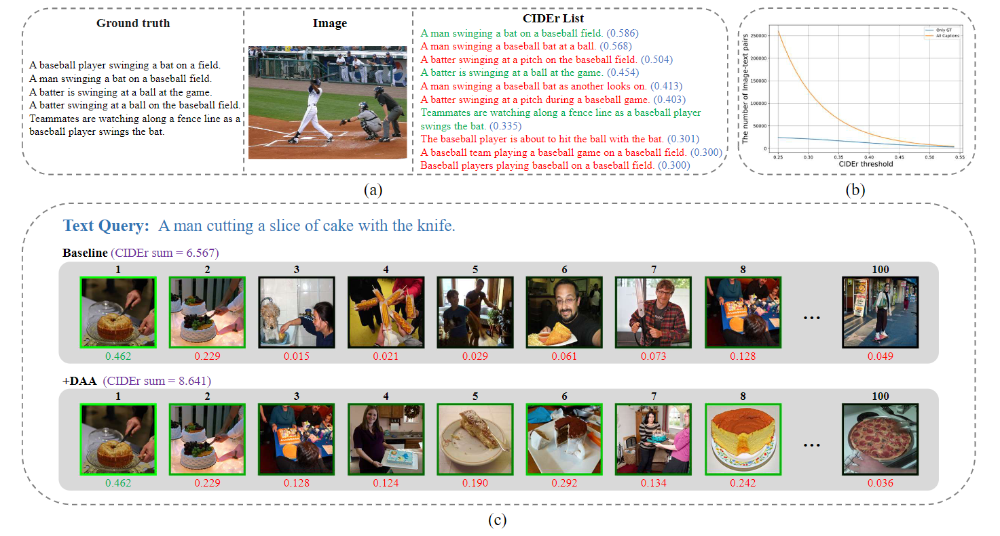
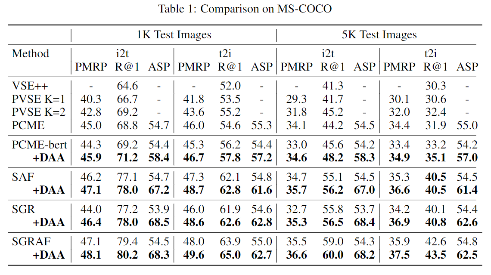

## Introduction
PyTorch implementation for NeurIPS2022 paper of [**“A Differentiable Semantic Metric Approximation in Probabilistic Embedding for Cross-Modal Retrieval”**](https://proceedings.neurips.cc/paper_files/paper/2022/file/4e786a87e7ae249de2b1aeaf5d8fde82-Paper-Conference.pdf).  It is built on top of the [SGRAF](https://github.com/Paranioar/SGRAF) in PyTorch. 




#### The full experiment results

<style type="text/css">
.tg  {border-collapse:collapse;border-spacing:0;}
.tg td{border-color:black;border-style:solid;border-width:1px;font-family:Arial, sans-serif;font-size:14px;
  overflow:hidden;padding:10px 5px;word-break:normal;}
.tg th{border-color:black;border-style:solid;border-width:1px;font-family:Arial, sans-serif;font-size:14px;
  font-weight:normal;overflow:hidden;padding:10px 5px;word-break:normal;}
.tg .tg-pb0m{border-color:inherit;text-align:center;vertical-align:bottom}
.tg .tg-lboi{border-color:inherit;text-align:left;vertical-align:middle}
.tg .tg-9wq8{border-color:inherit;text-align:center;vertical-align:middle}
</style>
<table class="tg">
<thead>
  <tr>
    <th class="tg-lboi" rowspan="2">Dataset</th>
    <th class="tg-9wq8" rowspan="2">Model</th>
    <th class="tg-pb0m" colspan="5">image-to-text</th>
    <th class="tg-pb0m" colspan="5">text-to-image</th>
  </tr>
  <tr>
    <th class="tg-pb0m">R@1</th>
    <th class="tg-pb0m">R@5</th>
    <th class="tg-pb0m">R@10</th>
    <th class="tg-pb0m">PMRP</th>
    <th class="tg-pb0m">ASP</th>
    <th class="tg-pb0m">R@1</th>
    <th class="tg-pb0m">R@5</th>
    <th class="tg-pb0m">R@10</th>
    <th class="tg-pb0m">PMRP</th>
    <th class="tg-pb0m">ASP</th>
  </tr>
</thead>
<tbody>
  <tr>
    <td class="tg-lboi" rowspan="3">Flickr30K</td>
    <td class="tg-pb0m">SAF</td>
    <td class="tg-pb0m">73.9</td>
    <td class="tg-pb0m">93.0</td>
    <td class="tg-pb0m">96.2</td>
    <td class="tg-pb0m">-</td>
    <td class="tg-pb0m">65.0</td>
    <td class="tg-pb0m">56.9</td>
    <td class="tg-pb0m">81.9</td>
    <td class="tg-pb0m">87.9</td>
    <td class="tg-pb0m">-</td>
    <td class="tg-pb0m">58.4</td>
  </tr>
  <tr>
    <td class="tg-pb0m">SGR</td>
    <td class="tg-pb0m">73.8</td>
    <td class="tg-pb0m">92.9</td>
    <td class="tg-pb0m">96.3</td>
    <td class="tg-pb0m">-</td>
    <td class="tg-pb0m">65.5</td>
    <td class="tg-pb0m">56.6</td>
    <td class="tg-pb0m">80.7</td>
    <td class="tg-pb0m">84.9</td>
    <td class="tg-pb0m">-</td>
    <td class="tg-pb0m">59.0</td>
  </tr>
  <tr>
    <td class="tg-pb0m">SGRAF</td>
    <td class="tg-pb0m">78.0</td>
    <td class="tg-pb0m">94.2</td>
    <td class="tg-pb0m">97.6</td>
    <td class="tg-pb0m">-</td>
    <td class="tg-pb0m">65.8</td>
    <td class="tg-pb0m">59.9</td>
    <td class="tg-pb0m">83.4</td>
    <td class="tg-pb0m">89.2</td>
    <td class="tg-pb0m">-</td>
    <td class="tg-pb0m">59.2</td>
  </tr>
  <tr>
    <td class="tg-lboi" rowspan="3">MSCOCO 1K</td>
    <td class="tg-pb0m">SAF</td>
    <td class="tg-pb0m">78.0</td>
    <td class="tg-pb0m">95.6</td>
    <td class="tg-pb0m">98.4</td>
    <td class="tg-pb0m">47.1</td>
    <td class="tg-pb0m">67.2</td>
    <td class="tg-pb0m">62.8</td>
    <td class="tg-pb0m">89.8</td>
    <td class="tg-pb0m">95.2</td>
    <td class="tg-pb0m">48.7</td>
    <td class="tg-pb0m">61.6</td>
  </tr>
  <tr>
    <td class="tg-pb0m">SGR</td>
    <td class="tg-pb0m">78.0</td>
    <td class="tg-pb0m">95.8</td>
    <td class="tg-pb0m">98.6</td>
    <td class="tg-pb0m">46.4</td>
    <td class="tg-pb0m">68.5</td>
    <td class="tg-pb0m">62.6</td>
    <td class="tg-pb0m">88.8</td>
    <td class="tg-pb0m">93.7</td>
    <td class="tg-pb0m">48.6</td>
    <td class="tg-pb0m">62.8</td>
  </tr>
  <tr>
    <td class="tg-pb0m">SGRAF</td>
    <td class="tg-pb0m">80.2</td>
    <td class="tg-pb0m">96.4</td>
    <td class="tg-pb0m">98.8</td>
    <td class="tg-pb0m">48.1</td>
    <td class="tg-pb0m">68.3</td>
    <td class="tg-pb0m">65.0</td>
    <td class="tg-pb0m">90.7</td>
    <td class="tg-pb0m">95.8</td>
    <td class="tg-pb0m">49.6</td>
    <td class="tg-pb0m">62.7</td>
  </tr>
  <tr>
    <td class="tg-lboi" rowspan="3">MSCOCO 5K</td>
    <td class="tg-pb0m">SAF</td>
    <td class="tg-pb0m">56.2</td>
    <td class="tg-pb0m">83.5</td>
    <td class="tg-pb0m">90.9</td>
    <td class="tg-pb0m">35.7</td>
    <td class="tg-pb0m">67.0</td>
    <td class="tg-pb0m">40.5</td>
    <td class="tg-pb0m">70.1</td>
    <td class="tg-pb0m">80.7</td>
    <td class="tg-pb0m">36.6</td>
    <td class="tg-pb0m">61.4</td>
  </tr>
  <tr>
    <td class="tg-pb0m">SGR</td>
    <td class="tg-pb0m">56.5</td>
    <td class="tg-pb0m">84.1</td>
    <td class="tg-pb0m">91.1</td>
    <td class="tg-pb0m">35.3</td>
    <td class="tg-pb0m">68.4</td>
    <td class="tg-pb0m">40.8</td>
    <td class="tg-pb0m">70.2</td>
    <td class="tg-pb0m">80.4</td>
    <td class="tg-pb0m">36.9</td>
    <td class="tg-pb0m">62.6</td>
  </tr>
  <tr>
    <td class="tg-pb0m">SGRAF</td>
    <td class="tg-pb0m">60.0</td>
    <td class="tg-pb0m">86.4</td>
    <td class="tg-pb0m">92.4</td>
    <td class="tg-pb0m">36.6</td>
    <td class="tg-pb0m">68.2</td>
    <td class="tg-pb0m">43.5</td>
    <td class="tg-pb0m">72.3</td>
    <td class="tg-pb0m">82.5</td>
    <td class="tg-pb0m">37.5</td>
    <td class="tg-pb0m">62.5</td>
  </tr>
</tbody>
</table>


## Requirements and Installation
We recommended the following dependencies.

* Python 3.8
* [PyTorch](http://pytorch.org/) 1.10.0
* [NumPy](http://www.numpy.org/) (>1.19.5)
* [TensorBoard](https://github.com/TeamHG-Memex/tensorboard_logger)

## Pretrained model
If you don't want to train from scratch, you can download the pretrained model from [here](https://drive.google.com/file/d/1hCiXyQBrYF7eP7JtNTaHQoqSZ18-mb2X/view?usp=sharing) (**SGR** for MS-COCO model), [here](https://drive.google.com/file/d/1o-Wch7pJMwOyf-RqEvsXgAUBhIO9fv8g/view?usp=sharing) (**SAF** for MS-COCO model), [here](https://drive.google.com/file/d/1Q0Ttw4yViWnupJA1whTAYGYHr-O56D4L/view?usp=sharing) (**SGR** for Flickr30K model) and [here](https://drive.google.com/file/d/1hvixWqDDCbkbBYK28dyZeEI6Nlc0qfAx/view?usp=sharing) (**SAF** for Flickr30K model). The performance of these pretrained models are as follows:



## Prepare data
We follow [SCAN](https://github.com/kuanghuei/SCAN) to obtain image features and vocabularies, which can be downloaded by using:

```bash
wget https://iudata.blob.core.windows.net/scan/data.zip
wget https://iudata.blob.core.windows.net/scan/vocab.zip
```
Another download link is available below：

```bash
https://drive.google.com/drive/u/0/folders/1os1Kr7HeTbh8FajBNegW8rjJf6GIhFqC
```

To speed up dataset loading, we convert these features from numpy.array to HDF5 file. Modify the **data_path** in `np2h.py` and then run `np2h.py`:
```bash
python np2h.py
```

## Training
Modify the **data_path**, **vocab_path**, **model_name**, **logger_name** in the `opts.py` file. Then run `train.py`:

For MSCOCO:

```bash
(For SGR) python train.py --data_name coco_precomp --num_epochs 30 --learning_rate 0.00015 --lr_update 20 --world_size 4 --module_name SGR --daa_weight 25
(For SAF) python train.py --data_name coco_precomp --num_epochs 30 --learning_rate 0.00015 --lr_update 20 --world_size 4 --module_name SAF --daa_weight 25
```

For Flickr30K:

```bash
(For SGR) python train.py --data_name f30k_precomp --num_epochs 40 --learning_rate 0.0006 --lr_update 30 --world_size 1 --module_name SGR --daa_weight 10
(For SAF) python train.py --data_name f30k_precomp --num_epochs 40 --learning_rate 0.0006 --lr_update 20 --world_size 1 --module_name SAF --daa_weight 10
```

## Evaluation

### Test on MSCOCO
To do cross-validation on MSCOCO, pass `fold5=True` with a model trained using `--data_name coco_precomp`.
```bash
python evaluation.py
```


### Test on Flickr30K
To test on Flickr30K, pass `fold5=False` with a model trained using `--data_name f30k_precomp`.
```bash
python evaluation.py
```

## How to compute PMRP score

PMRP is a metric to evaluate the diversity of model. More details could find in [PCME](https://arxiv.org/abs/2101.05068).

### Prepare annotations
Before evalution, you should download the **captions_val2014.json** and **instances_val2014.json** from [here](https://drive.google.com/drive/folders/16AQLWCDogM50pLMx0YFznmoFCAqiW8q8?usp=drive_link), or you can find them from [here](http://images.cocodataset.org/annotations/annotations_trainval2014.zip). 

Then put them in the path **pmrp_com/coco_ann**.

### Compute PMRP score

To compute pmrp score on MSCOCO-1K, you can run:
```bash
python pmrp_evaluation.py --path1 ${SIM_MATRIX} --n_fold 5
```

To compute pmrp score on MSCOCO-5K, you can run:
```bash
python pmrp_evaluation.py --path1 ${SIM_MATRIX} --n_fold 0
```

```${SIM_MATRIX}``` is the path of **npy format** similarity matrix with the **shape of (5000, 25000)** produced by the models. If you want to compute PMRP score of SGRAF (integration of SGR and SAF), add `--path2 ${SIM_MATRIX}` as the prediction of another model.

## Reference

If you found this code useful, please cite the following paper:
```
@inproceedings{li2022differentiable,
  author    = {Hao Li and
               Jingkuan Song and
               Lianli Gao and
               Pengpeng Zeng and
               Haonan Zhang and
               Gongfu Li},
  title     = {A Differentiable Semantic Metric Approximation in Probabilistic Embedding for Cross-Modal Retrieval},
  booktitle = {NeurIPS},
  year      = {2022}
}
```

